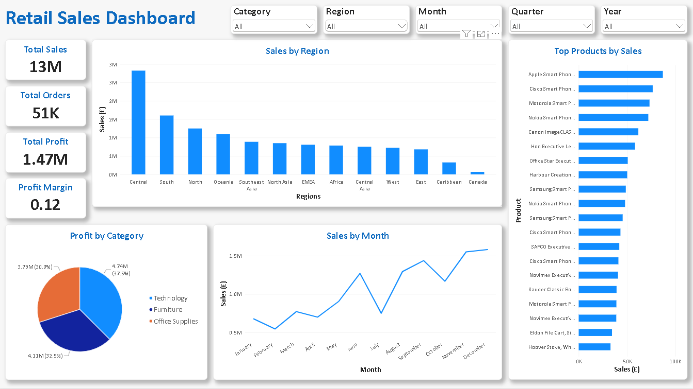
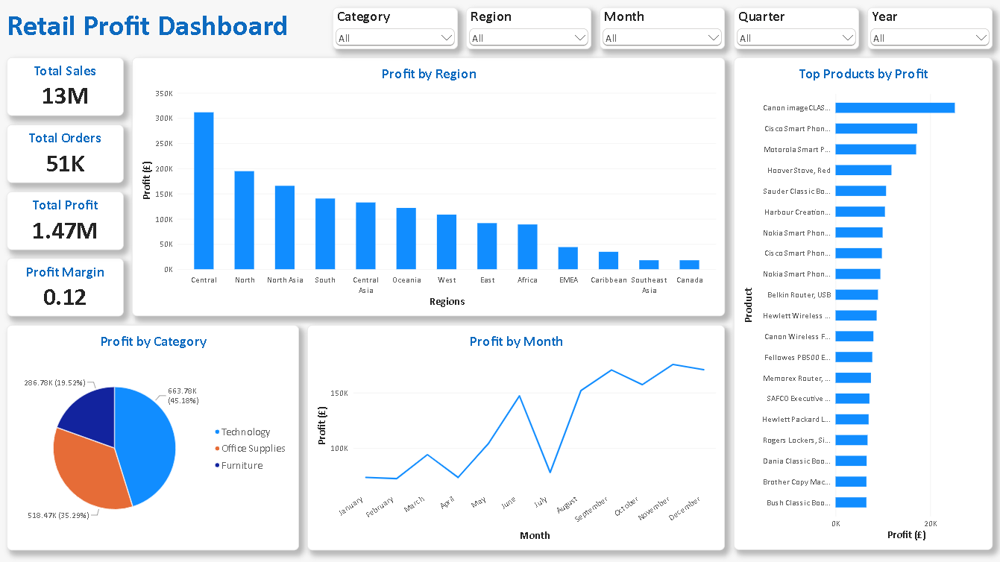

# Retail Sales Analysis

## Project Overview

This project analyses retail sales data using Python and Power BI to identify sales trends, product performance, regional performance and profitability.

The project demonstrates an end-to-end data analysis workflow:

**Raw Data → Python Data Cleaning → Exploratory Data Analysis → Power BI Dashboard → Business Insights**

## Tools Used

* Python
* Pandas
* NumPy
* Matplotlib
* Seaborn
* Power BI
* DAX
* Git/GitHub

## Project Structure

```text
Retail-Sales-Analysis/
│
├── data/
│   ├── retail_sales.csv
│   └── cleaned_sales_data.csv
│
├── python/
│   └── analysis.py
│
├── powerbi/
│   └── Retail_Sales_Dashboard.pbix
│
├── images/
│   └── dashboard.png
│
├── README.md
└── requirements.txt
```

## Python Analysis

Python was used to:

* Clean the dataset
* Remove duplicate records
* Handle date formatting
* Create additional analytical columns
* Analyse sales by region
* Analyse monthly sales trends
* Analyse profitability by category
* Export the cleaned dataset for Power BI

## Power BI Dashboards

The Power BI dashboards provides an interactive view of:

* Total Sales
* Total Profit
* Profit Margin
* Sales by Region
* Profits by Region
* Sales Trends
* Profit Trends
* Top Products
* Sales by Category
* Profit by Category

## Conclusion

This project demonstrates how Python can be used for data cleaning and exploratory analysis before presenting the results through an interactive Power BI dashboard.

## Dashboard Preview



